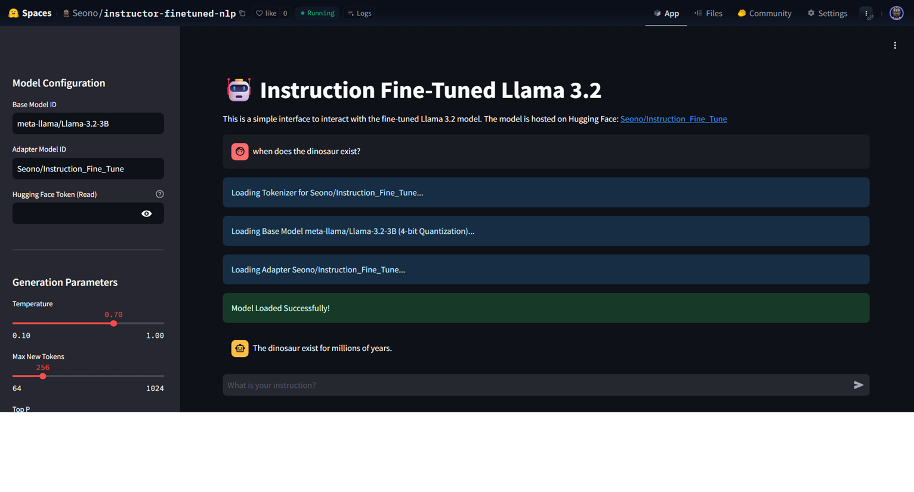

# NLP Fine-Tuning Project

This project demonstrates the end-to-end process of fine-tuning a Large Language Model (LLM) for a specific task, deploying it to Hugging Face, and creating a user-friendly frontend application.



## 🚀 Features

- **Fine-Tuning**: Utilizes QLoRA (Quantized Low-Rank Adaptation) to fine-tune a base model on a custom dataset.
- **Efficient Training**: Implements 4-bit quantization using `bitsandbytes` to reduce memory usage during training.
- **Inference Engine**: Includes a script to load the fine-tuned model and generate responses.
- **Interactive Frontend**: A Streamlit-based web application for easy interaction with the model.
- **Deployment**: Scripts to deploy the model and application to Hugging Face Spaces.

## 🛠️ Tech Stack

- **Language**: Python
- **Libraries**:
  - `transformers` & `peft`: For model loading and fine-tuning.
  - `bitsandbytes`: For quantization.
  - `trl`: For SFT (Supervised Fine-Tuning).
  - `streamlit`: For the web interface.
  - `huggingface_hub`: For deployment.

## 📦 Installation

1. Clone the repository:
   ```bash
   git clone https://github.com/shyeom01/Llama3.2_3B_with_assistant_AI.git
   cd Llama3.2_3B_with_assistant_AI
   ```

2. Install dependencies:
   ```bash
   pip install -r requirements.txt
   ```

## 💻 Usage

### Running the Web App Locally
To start the Streamlit interface:
```bash
streamlit run app.py
```

### Fine-Tuning
To reproduce the fine-tuning process:
```bash
python fine_tune.py
```

### Inference
To run inference in the terminal:
```bash
python use_model.py
```

## 🌐 Deployment

The model is deployed on Hugging Face. You can view the live demo here: [Link to your Hugging Face Space]

## 📂 Project Structure

- `app.py`: Streamlit application for the frontend.
- `fine_tune.py`: Script for fine-tuning the model.
- `use_model.py`: Script for running inference.
- `deploy.py`: Helper script for deploying to Hugging Face.
- `baseModelLoader.py`: Utility to load the base model.
- `requirements.txt`: List of dependencies.

---
*Created by [Your Name]*
